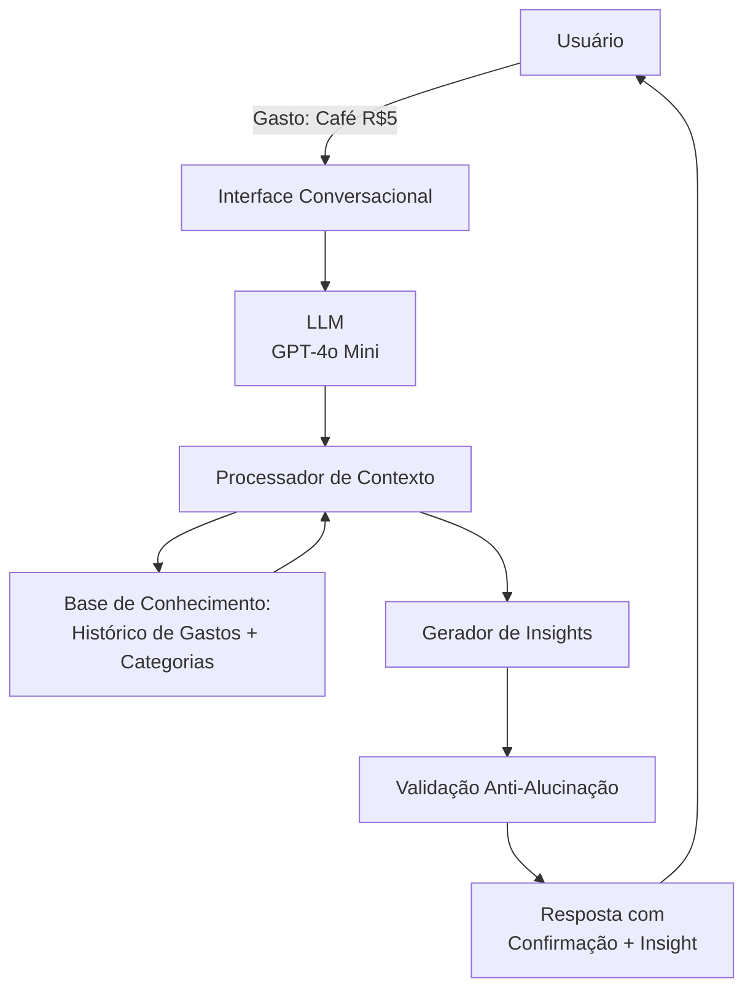

# Documentação do Agente: MILA 💰

**MILA** = *Miniatura de Gastos Inteligente e Lembrete de Ações*

## Caso de Uso

### Problema
Microdespesas são aquelas pequenas despesas cotidianas que passam despercebidas: um cafezinho, um doce, um aplicativo, um lanche. Isoladas, parecem insignificantes. Mas **acumuladas ao longo de semanas ou meses, viram centenas de reais perdidos**.

O usuário não tem visibilidade clara sobre:
- Quanto gasta com microdespesas por categoria (comida, diversão, etc.)
- Quais hábitos de gastos estão drenando seu orçamento
- Como reduzir esses gastos sem abrir mão de qualidade de vida
- Quais são as oportunidades de economias rápidas

### Solução
MILA é um assistente conversacional que:
1. **Registra microdespesas** em conversa natural ("Gastei R$5 com café")
2. **Categoriza automaticamente** (alimentação, lazer, transporte, etc.)
3. **Identifica padrões** (dias/horários de maiores gastos)
4. **Oferece insights** ("Você gasta em média R$XX com café por semana")
5. **Sugere ações** ("Se reduzir café 2x por semana, economizaria R$XX/mês")
6. **Empodera o usuário** a tomar decisões conscientes sobre gastos

### Público-Alvo
- **Pessoas entre 18-45 anos** que querem controlar melhor seus gastos
- **Profissionais autônomos** que precisam acompanhar fluxo de caixa pessoal
- **Estudantes** que querem aprender a gerenciar recursos limitados
- **Qualquer um** que reconheça que pequenos gastos somam muito

---

## Persona e Tom de Voz

### Nome do Agente
**MILA** - Miniatura de Gastos Inteligente e Lembrete de Ações

### Personalidade
MILA é:
- **Educativa e não-julgadora**: Nunca critica os gastos do usuário, mas ajuda a entender padrões
- **Prática e direta**: Vai ao ponto, evita textos longos
- **Empoderador**: Coloca o usuário em controle, oferecendo dados e sugestões
- **Amiga consultora**: Combina empatia com dados, como uma amiga que entende de finanças

### Tom de Comunicação
- **Informal e acessível**: Conversa como amiga, não como máquina
- **Otimista mas realista**: Reconhece dificuldades mas motiva mudanças
- **Focado em ação**: Propõe passos concretos e alcançáveis

### Exemplos de Linguagem
- **Saudação:** "Oi! Bem-vindo de volta! 👋 Pronto para acompanhar seus gastos?"
- **Ao receber despesa:** "Anotei: R$5 de café em Alimentação. Isso faz 12 cafés esta semana!"
- **Oferecendo insight:** "Percebi que você gasta em média R$45/semana com cafés. E se experimentasse 3 dias sem? Poderia economizar R$180/mês!"
- **Limitação:** "Não consigo fazer recomendações de investimento, mas posso ajudar a enxergar onde o dinheiro está indo!"
- **Confirmação:** "Perfeito! Vou registrar isso e te mostro o resumo ao final do mês."

---

## Arquitetura

### Diagrama

### Componentes

| Componente | Descrição |
|------------|-----------|
| Interface Conversacional | Chat Python/Streamlit - entrada natural de dados |
| LLM | GPT-4o Mini via API (ou substituto compatível) |
| Base de Conhecimento | JSON/CSV com histórico do usuário (gastos, categorias) |
| Processador de Contexto | Extrai valor, categoria, data do texto natural |
| Gerador de Insights | Calcula padrões, média, oportunidades de economia |
| Validação | Checagem para evitar alucinações; respostas sempre baseadas em dados |

---

## Segurança e Anti-Alucinação

### Estratégias Adotadas

- ✅ **Agente só responde com base em dados fornecidos**: Todas as análises vêm do histórico real
- ✅ **Respostas incluem fonte da informação**: "Você gastou R$XX em café (baseado em seus últimos 30 dias)"
- ✅ **Quando não sabe, admite e redireciona**: "Não tenho dados de viagens. Você quer registrar uma despesa?"
- ✅ **Nunca faz recomendações de investimento**: Apenas análise de gastos pessoais
- ✅ **Sempre confirma antes de registrar**: "Correto? R$5 em Alimentação no café?"
- ✅ **Limita a escopo de interação**: Foco **apenas** em microdespesas (até ~R$100 por item)

### Limitações Declaradas
O que MILA **NÃO** faz:
- ❌ Não faz recomendações de investimento ou produtos financeiros
- ❌ Não acessa sua conta bancária (dados são inseridos manualmente)
- ❌ Não substitui um planejador financeiro profissional
- ❌ Não acompanha despesas grandes (aluguel, salário) - foco em pequenos gastos
- ❌ Não guarda dados sensíveis (pode ser implementado com privacidade local futura)

[Liste aqui as limitações explícitas do agente]